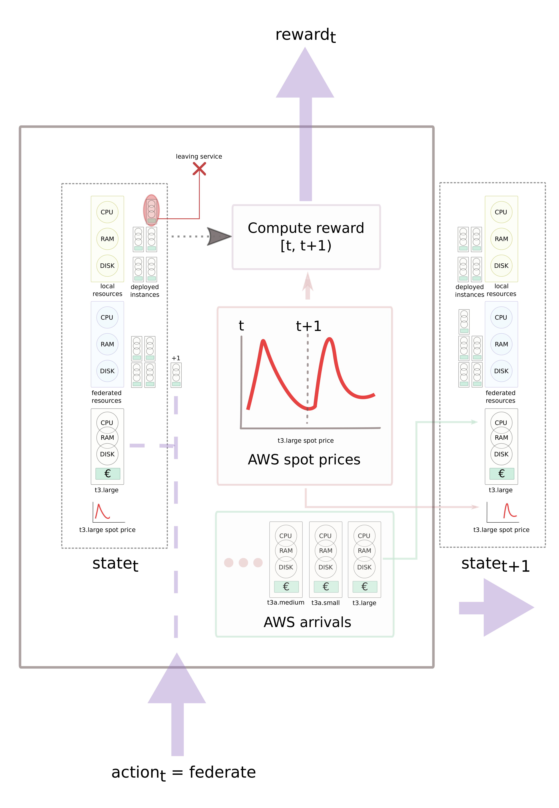
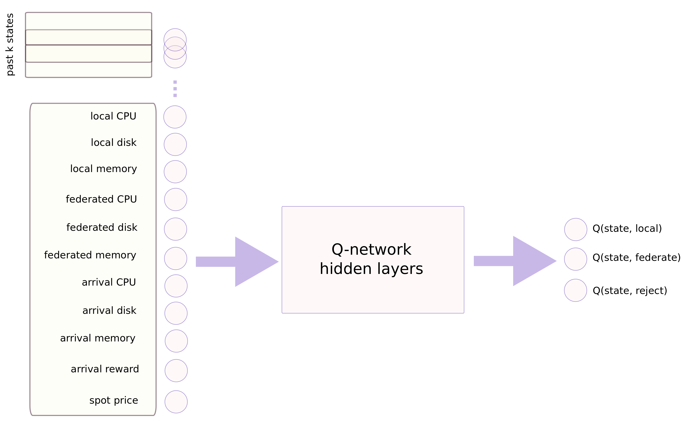

# AWS
This directory contains some scripts used to generate service arrivals using
AWS data, the truncated lifetime [1], and the arrival/departure rates of [2].

Image below illustrates the pipeline of how to use the scripts to generate the
arrivals.
The AWS JSON is obtained using a line like:
```bash
aws ec2 describe-spot-price-history  --start-time 2020-03-01 --end-time 2020-05-25
```
then that file is fed to the 1st script of the pipeline.


## Genrate the spot prices CSV
To generate covnert the AWS spot prices data from JSON to CSV execute:
```bash
python3 ec2_prices_to_csv.py\
    aws-ec2-prices-march-to-may.json\   # AWS JSON with spot prices over time
    eu-west-3a\                         # region to filter
    "m5a.2xlarge|m5a.12xlarge|m5a.16xlarge|m5ad.2xlarge|m5ad.16xlarge|m5d.2xlarge|m5d.large|m5d.8xlarge|m5d.8xlarge|m5d.16xlarge|m5d.24xlarge|t2.large|t3.large|t3a.nano|t3a.medium|t3a.small|c5x.large|c5.2xlarge|c5.18xlarge|c5.metal|c5d.xlarge|c5d.4xlarge|c5d.18xlarge"\  # instances to filter
    /tmp/ec2-prices-march-to-may.csv    # CSV file where prices are stored
```

The resulting CSV `/tmp/ec2-march-to-may.csv` contains this information:

| Column   |  Definition   | Example |
|----------|:-------------:|---------|
| **AvailabilityZone**   | AWS zone where pricing applies | eu-west-3a |
| **InstanceType**       | AWS instance type | t3a.nano |
| **ProductDescription** | Operating system | Linux/UNIX |
| **SpotPrice**          | $/hour               | 0.061700 |
| **Timestamp**          | UTC record timestamp | 020-05-24T23:00:03+00:00 |


## Calculate the rewards
The pipeline assumes that each service arrival has an associated reward
expressed as $/h, i.e., if the service is locally deployed, the infrastructure
owner wins $ each hour it hosts the service.

Given the spot prices CSV, the following script derives the service arrivals
rewards running:
```bash
python3 calc_rewards.py\
        instance-info.json\              # JSON with the EC2 instances info.
        /tmp/ec2-march-to-may.csv\       # CSV with the spot prices history
        x2avgPrice\                      # method used to derive the reward
        /tmp/instances-info-rewards.json # path where JSON with rewards goes
```

There are two methods to derive the the reward

| method | description |
|--------|-------------|
| **x2avgPrice** |  the instance reward is twice the average spot price |
| **x2maxPrice** | the instance reward is twice the maximum spot price |


## Generate the arrivals
After executing all scripts above, one derives the arrivals of services
running:
```bash
python3 gen_ec2_arrivals.py\
    /tmp/ec2-prices-march-to-may.csv\  # path to CSV with EC2 spot prices
    /tmp/instances-info-rewards.json\  # Path to JSON with instance information
    "*"\                               # instances to include
    40\                                # lifetime std %
    /tmp/aws-arrivals.csv              # out file
```

the resulting CSV `/tmp/aws-arrivals.csv` contains a list of service arrivals 
with following information:

| Column   | description | example |
|----------|-------------|---------|
| **time** | UNIX epoch sec. since 1970 | 1582934578.9602706 |
| **instance** | AWS instance type | c5.2xlarge | 
| **spotprice** | $/h when service arrived | 0.2521 |
| **lifetime** | days the service lasts | 6.007251392402977 |
| **os** | OS required by the service | Linux/UNIX |
| **cpu** | #cpus required by the service | 8
| **memory** | GB of memory required by service | 16.0 |
| **disk** | GB of disk space required by the service | 400 |
| **reward** | $/h reward obtained by hosting the service | 0.472 |


# The AWS environment

Inside script `aws_env.py` there is a class named `AWS_env`. It implements
the `take_action()` and `get_state()` logic to use any agent on top of it.
As shown in the illustration above, the environment contains the following
information:
 * local, and federated domain resources
 * AWS spot prices (see above)
 * CSV of AWS instances arrivals (see above)

The environment is created and initialized by invoking:
```python3
import json
import pandas as pd

# Load the local and federated domain resources
with open('domains.json') as fp:
    domain = json.load(fp)

# Load the AWS spot prices Dataframe
prices_df = pd.read_csv('ec2-prices-march-to-may.csv')
prices_df['Timestamp'] = pd.to_datetime(prices_df['Timestamp'])

# Load the AWS arrivals
arrivals = pd.read_csv('aws-arrivals.csv')

# Create the environment
env = AWS_env(cpu=domain['local']['cpu'], memory=domain['local']['memory'],
        disk=domain['local']['disk'], f_cpu=domain ['federated']['cpu'],
        f_disk=domain['federated']['disk'],
        f_memory=domain['federated']['memory'],
        arrivals=arrivals,
        spot_prices=prices_df)

```

Now `env` contains an AWS environment instance ready to be used as follows:
```python3
state = env.get_state()
while state != None:
    # Actions available are 
    #    AWS_env.A_LOCAL
    #    AWS_env.A_FEDERATE
    #    AWS_env.A_REJECT
    a = choose_action() # this depends on your agent
    reward, next_state = env.take_action(a)
    
    # [...]

    state = next_state
```
In case you want to restart the environment to its initial state, run
`env.reset()`.


# Q-network based agent

The script `dqn.py` contains a Q-network based on [3] to interact with the
AWS environment. The network receives as state the:
 * local resources
 * federated resources
 * arrival instance asked resources
 * arrival instance €/hour
 * AWS spot price for that instance when it arrived
based on that it estimates the Q-value for each action it can take, i.e.,
deploy locally, federate, or reject the arrival.

To train the Q-network you invoke the python script as:
```bash
python3 dqn.py\
    ec2-prices-march-to-may.csv\       # AWS spot prices
    "t3a.small|t3a.medium|t3.large"\   # instances to use
    aws-arrivals.csv\                  # instances' arrivals
    domains.json\                      # local|fed resources JSON
    2\                                 # k=#input_states
    --train\                           # flag to specify training
    --epsilon_start 1\                 # epsilon-greedy value @training-start
    --epsilon_end 0.1\                 # epsilon-greedy value @training-end
    --gamma 0.01\                      # discount factor
    --alpha 0.01\                      # learning rate for gradiend descend
    --M 50\                            # training episodes
    --batch 30\                        # batch size to compute error
    --N 200\                           # replay memory size
    --out_model /tmp/model\            # path where model values are stored
    &> /tmp/log                        # log file
```

Once the network is trained, it is ready to be used by running:
```bash
python3 dqn.py\
    ec2-prices-march-to-may.csv\       # AWS spot prices
    "t3a.small|t3a.medium|t3.large"\   # instances to use
    aws-arrivals.csv\                  # instances' arrivals
    domains.json\                      # local|fed resources JSON
    2\                                 # k=#input_states
    --in_model /tmp/model\             # path where trained model is stored
    &> /tmp/log                        # log file
```
as output it will prompt a list of `state|action|reward` lines.

# Q-learning (master branch) applied to the AWS environment
The script `q_learning_plain.py` contains a basic Q-learnig approach based on [4] to interact with the
AWS environment. The network receives as state the:
 * local resources
 * federated resources
 * arrival instance asked resources
 * arrival instance €/hour
 * AWS spot price for that instance when it arrived
At the start of the simulation, action is choosen randomly (deploy locally, federate or reject the service arrival). The action is executed in the AWS environment (with `take_action()`). The taken action returns the reward for the executed action of the arrived service. The returned reward is used to update the Q-table of the q-learning algorithm. As the simulation progress, the decision is "leaning" towards the Q-table values.

To train the plain Q-learning approach the script is invoked in similar manner: 
```bash
python3 q_learning_plain.py\
    ec2-prices-march-to-may.csv\       # AWS spot prices
    "t3a.small|t3a.medium|t3.large"\   # instances to use
    aws-arrivals.csv\                  # instances' arrivals
    domains.json\                      # local|fed resources JSON
    --train\                           # flag to specify training
    --epsilon_start 1\                 # epsilon-greedy value @training-start
    --epsilon_end 0.1\                 # epsilon-greedy value @training-end
    --gamma 0.01\                      # discount factor
    --alpha 0.01\                      # learning rate for gradiend descend
    --M 50\                            # training episodes
    --out_model /tmp/model\            # path where model values are stored
    &> /tmp/log                        # log file
```

Once the Q-table is populated and trained, it is ready to be used by running:
```bash
python3 q_learning_plain.py\
    ec2-prices-march-to-may.csv\       # AWS spot prices
    "t3a.small|t3a.medium|t3.large"\   # instances to use
    aws-arrivals.csv\                  # instances' arrivals
    domains.json\                      # local|fed resources JSON
    --in_model /tmp/model\             # path where trained model is stored
    &> /tmp/log                        # log file
```
as output it will prompt a list of `state|action|reward` lines.

# Greedy approach (TID) applied to the AWS environment
The script `greedy_plain.py` contains a basic greedy approach based on [4] to interact with the
AWS environment. The network receives as state the:
 * local resources
 * federated resources
 * arrival instance asked resources
 * arrival instance €/hour
 * AWS spot price for that instance when it arrived
For each arrival, the algorithm checks the state of the local resources. If the local resources are available, the arrival is deployed locally. If there are not enough local resources, the algorithm checks the state of the federated resources. If there are enough federated resources, the arrival is deployed in the federated domain. If there are not enough local and not enough federated resources, the service arrival is rejected. 

To run the greedy algorithm, the script is invoked as:
```bash
python3 greedy_plain.py\
    ec2-prices-march-to-may.csv\       # AWS spot prices
    "t3a.small|t3a.medium|t3.large"\   # instances to use
    aws-arrivals.csv\                  # instances' arrivals
    domains.json\                      # local|fed resources JSON
    &> /tmp/log                        # log file
```

## References
[1] Xu, Hong, and Baochun Li. "Dynamic cloud pricing for revenue maximization." IEEE Transactions on Cloud Computing 1.2 (2013): 158-171.

[2] Information Exchange to Support Multi-Domain Slice Service Provision for 5G/NFV

[3] Mnih, Volodymyr, et al. "Playing atari with deep reinforcement learning." arXiv preprint arXiv:1312.5602 (2013).

[4] Antevski, Kiril, et al. "A Q-learning strategy for federation of 5G services", ICC 2020

[5] Solano, Alberto and Contreras, Luis M. "Information Exchange to Support Multi-Domain Slice Service Provision for 5G/NFV", 2nd International Workshop on Network Slicing (Network Slicing 2020),International Federation for Information Processing (IFIP) Networking 2020 Conference (NETWORKING 2020)