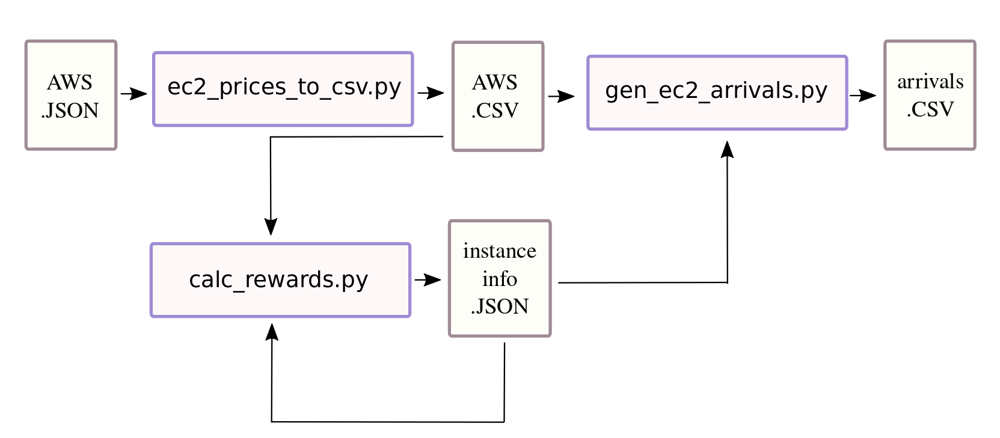

# AWS
This directory contains some scripts used to generate service arrivals using
AWS data, the truncated lifetime [1], and the arrival/departure rates of [2].

Image below illustrates the pipeline of how to use the scripts to generate the
arrivals.
The AWS JSON is obtained using a line like:
```bash
aws ec2 describe-spot-price-history  --start-time 2020-03-01 --end-time 2020-05-25
```
then that file is fed to the 1st script of the pipeline.



## Generate the arrivals
Just execute script as below:
```bash
python3 gen_ec2_arrivals.py\
    ec2-prices-march-to-may.csv\  # path to CSV with EC2 spot prices
    instance-info.json\           # Path to JSON with instance information
    "*"\                          # instances to include
    40\                           # lifetime std %
    aws-arrivals.csv              # out file
```


## References
[1] Xu, Hong, and Baochun Li. "Dynamic cloud pricing for revenue maximization." IEEE Transactions on Cloud Computing 1.2 (2013): 158-171.

[2] Information Exchange to Support Multi-Domain Slice Service Provision for 5G/NFV

